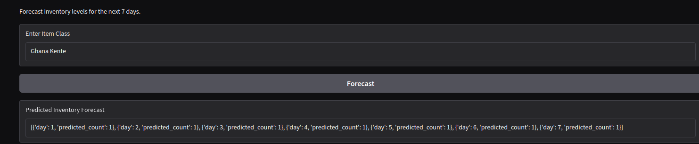
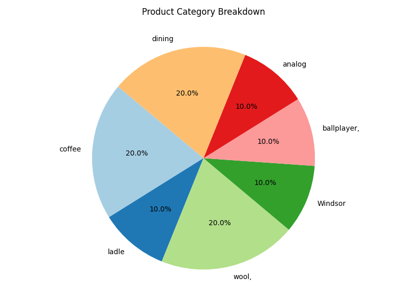

# Table of Contents
- [Introduction](#nvidia-ai-workbench-introduction)
   - [Project Description](#project-description)
   - [Prerequisites](#prerequisites)

## Project Description

This project aims to develop an application with models (Google ViT (Base), Google ViT (Large), Microsoft ResNet50, Facebook ConvNeXt Tiny, Google MobileNetV3) featuring a fully customizable **Gradio Image Recognition** interface. Key functionalities include:

- The ability to upload images or capture live photos for identification.
- Performing image recognition **locally** or **remote** by running inference directly on the model.

### Table 1: Default Supported Models by Inference Mode

## Prerequisites

- Familiarity with **Hugging Face** and its ecosystem.

---

## System Requirements
Below are the minimum and recommended system requirements for the project:

| vRAM  | System RAM | Disk Storage | vCPU         | GPU                   |
|-------|------------|--------------|--------------|-----------------------|
| 8 GB | 16 GB      | 70 GB        | Intel Core i7| At least 1 (optional) |

## App Features

### 1. **Model Selection**
Choose from a range of advanced models for image recognition:

- **Google ViT (Base)**: A powerful vision transformer model for efficient image classification.
- **Google ViT (Large)**: A larger version of ViT, offering improved performance on complex tasks.
- **Microsoft ResNet50**: A deep convolutional network designed for image recognition tasks, known for its efficiency.
- **Facebook ConvNeXt Tiny**: A compact model optimized for fast inference without sacrificing accuracy.
- **Microsoft Swin**: A hierarchical vision transformer model that scales well across image sizes and tasks.

### 2. **Fine-Tuning**
Fine-tune the selected model to enhance its accuracy for your specific use case:

- Adjust **hyperparameters** to optimize model performance.
- Upload your own **labeled dataset** for fine-tuning, allowing the model to better understand your domain-specific images.

### 3. **Bulk Image Classification**

- **Upload multiple images** at once for batch processing.
- Classify a large set of images in one go and retrieve results efficiently.

### 4. **Inventory Management**
Keep track of the images you've uploaded and their corresponding classification results:

- View the **classification labels** and associated data for each image.
- Monitor the inventory status of your image dataset for easy access and management.

### 5. **Forecasting**

- Use the **classification results** to predict future trends or behaviors.
- Forecast future inventory needs or category distributions based on historical classification data.

### 6. **Inventory Analytics Dashboard**
Visualize and analyze your inventory and classification results through various charts:

- **Bar Chart**: Display the distribution of classified items across categories.
    

- **Pie Chart**: Visualize the proportion of categories within your dataset.
    

- **Line Chart**: Track trends and patterns in your inventory over time.
      

- **Heatmap**: Explore the relationships between various attributes in your dataset and visualize patterns.
    

---

### Additional Features:
- **User-Friendly Interface**: Intuitive navigation and easy-to-use options for a seamless experience.
- **Model Switching**: Easily change between models as per your needs, allowing flexible image recognition capabilities.
- **Real-time Updates**: Get instant feedback and results for each image classification task.
